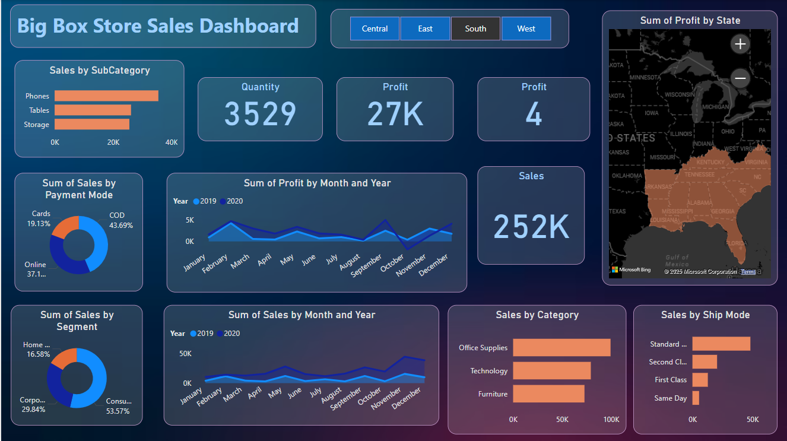

# 🛒 BigBox Sales Analytics Dashboard – Power BI

This repository contains a fully interactive Power BI dashboard designed to analyze and visualize sales performance data for **BigBox**, a fictional retail company. The dashboard highlights key metrics across categories, regions, products, and time periods, enabling clear business insights and data-driven decisions.

---

## 📌 Overview

The **BigBox Sales Dashboard** is a business intelligence solution built to monitor and evaluate:

- 📦 Product Category Performance  
- 🌍 Regional & City-Wise Sales  
- 🕒 Time-Based Trends (Monthly/Yearly)  
- 📈 Profitability & Revenue Metrics  
- 🛍 Top Performing Products & Segments

---

## 📊 Key Visuals & KPIs

- **Sales vs Profit Cards** – Snapshot of core business outcomes  
- **Bar & Column Charts** – Compare performance across cities, regions, and products  
- **Time Series Line Graphs** – Monthly/yearly trend analysis  
- **Category Breakdown** – Visual pie/donut charts for sales by product category  
- **Interactive Filters** – Slicers for category, region, and time period  

---

## 🛠 Tools Used

- **Power BI Desktop** – For visualizations and report building  
- **Power Query Editor** – For data transformation and modeling  
- **DAX (Data Analysis Expressions)** – For calculated columns and KPIs  
- **Excel/CSV Dataset** – As the backend source (fictional sales data)

---

## 🧩 Data Model Structure

The data model includes:

- **Fact Table**: Sales data containing revenue, cost, profit, quantity, etc.  
- **Dimension Tables**:
  - Date (with hierarchy for year/month)
  - Product (category/sub-category)
  - Customer (region/city)

---

## 📈 Business Insights Delivered

- Identify **best-selling categories and products**
- Track **revenue and profit growth** over time
- Uncover **underperforming regions or segments**
- Empower managers with a **visual storytelling tool** for retail KPIs

---

## 🚀 How to Use

1. Clone this repository or download the `.pbix` file.
2. Open the file in **Power BI Desktop**.
3. Refresh the data (if connected to a live source) or explore existing visuals.
4. Use filters/slicers to interact with the report.

---

## 📷 Dashboard Preview

*(Add a screenshot here if available)*  
```md

